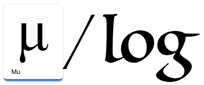
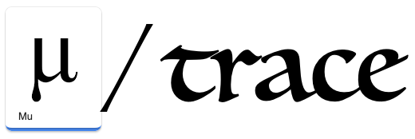
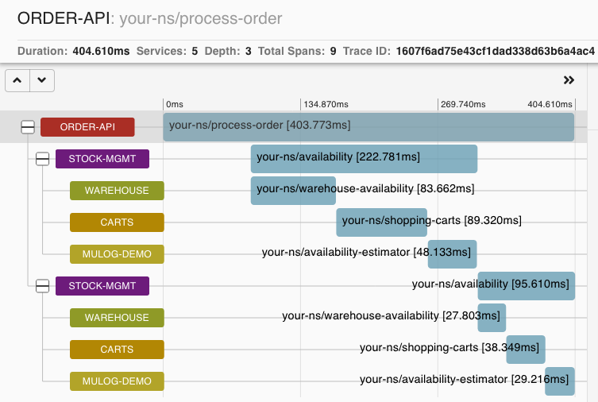

# μ/log
[](https://clojars.org/com.brunobonacci/mulog)
[](https://cljdoc.org/d/com.brunobonacci/mulog/)
[](https://circleci.com/gh/BrunoBonacci/mulog)




***μ/log*** *(Pronounced: /mjuːlog/)* is a micro-logging library that logs events and data, not words!


> From the Greek letter **μ**, **mu** *(Pronunciation: /mjuː/)* <br/>
> The twelfth letter of the
> Greek alphabet (Μ, μ), often used as a prefix for *micro-* which is
> 10<sup>-6</sup> in the SI (System of Units). Lowercase letter "`u`" is often
> substituted for "`μ`" when the Greek character is not typographically
> available.<p/>
> *(source: [https://en.wikipedia.org/wiki/Mu_(letter)](https://en.wikipedia.org/wiki/Mu_(letter)))*
> <br/>


## Features

Here some features and key design decisions that make ***μ/log*** special:

  * Effortlessly, logs events as data points.
  * No need to construct strings that then need to be deconstructed later.
  * Fast, extremely fast, under **300 nanoseconds** per log entry
  * Memory bound; no unbounded use of memory
  * All the processing and rendering happens asynchronously.
  * Ability to add contextual logging.
  * Adding publishers won't affect logging performances
  * Extremely easy to create *stateful* publishers for new systems
  * Wide range of publishers available ([see available list](./doc/publishers))
  * *Event logs are useful, but not as important as process flow
    (therefore preferable to drop events rather than crashing the
    process)*
  * Because it is cheap to log events, you can freely log plenty.
  * And events are **just data** so can process, enrich, filter,
    aggregate, visualise the data with your own tools.


## Motivation

It is not the intention of ***µ/log*** to be a logging system in the
sense of Log4j et al. In any significant project I worked in the last
15 years, logging text messages resulted in a large amount of strings
which was hard to make sense of, thus mostly ignored. ***µ/log***'s
idea is to replace the "*3 Pillars of Observability*" with a more
fundamental concept: "**the event**". Event-based data is easy to
index, search, augment, aggregate and visualise therefore can easily
replace traditional logs, metrics and traces.

Existing logging libraries are based on a design from the 80s and
early 90s.  Most of the systems at the time where developed in
standalone servers where logging messages to console or file was the
predominant thing to do. Logging was mostly providing debugging
information and system behavioural introspection.

Most of modern systems are distributed in virtualized machines that
live in the cloud. These machines could disappear any time. In this
context logging on the local file system isn't useful as logs are
easily lost if virtual machines are destroyed. Therefore it is common
practice to use log collectors and centralized log processors. The ELK
stack it has been predominant in this space for years, but there are a
multitude of other commercial and open-source products.

Most of these systems have to deal with non structured data
represented as formatted strings in files. The process of extracting
information out of these strings is very tedious, error prone, and
definitely not fun. But the question is: **why did we encode these as
strings in the first place?** This is just because existing log
frameworks, which have been redesigned in various decades follow the
same structure as when systems lived on the same single server for
decades.

I believe we need the break free of these anachronistic designs and use
event loggers, *not message loggers*, which are designed for dynamic
distributed systems living in cloud and using centralized log
aggregators. *So here is ***μ/log*** designed for this very purpose.*

Watch my talk on ***μ/log*** at the *London Clojurians Meetup*:

[](https://www.youtube.com/watch?v=P1149dWnl3k)

## Table of contents

<!-- markdown-toc start - Don't edit this section. Run M-x markdown-toc-refresh-toc -->

 - [Features](#features)
 - [Motivation](#motivation)
 - [Table of contents](#table-of-contents)
 - [Usage](#usage)
     - [Use of context](#use-of-context)
 - [Best practices](#best-practices)
 - [***μ/trace***](#μtrace)
 - [Publishers](#publishers)
 - [Additional topics](#additional-topics)
 - [Contributions](#contributions)
 - [Related projects](#related-projects)
 - [License](#license)

<!-- markdown-toc end -->


## Usage

In order to use the library add the dependency to your `project.clj`

``` clojure
;; Leiningen project
[com.brunobonacci/mulog "0.8.2"]

;; deps.edn format
{:deps { com.brunobonacci/mulog {:mvn/version "0.8.2"}}}
```

Current version: [](https://clojars.org/com.brunobonacci/mulog)


Then require the namespace:

``` clojure
(ns your-ns
  (:require [com.brunobonacci.mulog :as μ]))

;; or for the more ASCII traditionalists
(ns your-ns
  (:require [com.brunobonacci.mulog :as u]))
```

Check the [online documentation](https://cljdoc.org/d/com.brunobonacci/mulog/CURRENT)

Then instrument your code with the log you deem useful. The general structure is

``` clojure
(μ/log event-name, key1 value1, key2 value2, ... keyN valueN)
```

For example:
``` clojure
;; good to use namespaced keywords for the event-name
(μ/log ::hello :to "New World!")
```

However you will NOT be able to see any events until you add a
publisher which will take your events and send them to a distributed
logger of your local console (if you are developing).

You can add as many key-value pairs as you deem useful to express the event in your system
``` clojure
(μ/start-publisher! {:type :console})
```

At this point you should be able to see the previous event in your
REPL terminal and it will look as follows:

``` clojure
{:mulog/trace-id #mulog/flake "4VTBeu2scrIEMle9us8StnmvRrj9ThWP", :mulog/timestamp 1587500402972, :mulog/event-name :your-ns/hello, :mulog/namespace "your-ns", :to "New World!"}
```

Here are some example of events you might want to log.

``` clojure
;; The general form is
(μ/log ::event-name, :key1 "value1", :key2 :value2, :keyN "valueN")

;; examples
(μ/log ::system-started :version "0.1.0" :init-time 32)

(μ/log ::user-logged :user-id "1234567" :remote-ip "1.2.3.4" :auth-method :password-login)

(μ/log ::http-request :path "/orders", :method :post, :remote-ip "1.2.3.4", :http-status 201, :request-time 129)

(def x (RuntimeException. "Boom!"))
(μ/log ::invalid-request :exception x, :user-id "123456789", :items-requested 47)

(μ/log ::position-updated :poi "1234567" :location {:lat 51.4978128, :lng -0.1767122} )
```

All above are examples of events you might want to track, collect and
aggregate on it in a specialized timeseries database.

### Use of context

Adding events which are rich in attributes and dimensions is extremely
useful, however it is not easy to have all the attributes and
dimensions at your disposal everywhere in the code. To get around
this problem ***μ/log*** supports the use of context.

There are two levels of context, a global level and a local one.

The global context allows you to define properties and values which
will be added to all the events logged afterwards.

For example:

``` clojure
(μ/log ::system-started :init-time 32)
;; {:mulog/timestamp 1572709206048, :mulog/event-name :your-ns/system-started, :mulog/namespace "your-ns", :init-time 32}

;; set global context
(μ/set-global-context! {:app-name "mulog-demo", :version "0.1.0", :env "local"})

(μ/log ::system-started :init-time 32)
;; {:mulog/event-name :your-ns/system-started,
;;  :mulog/timestamp 1587501375129,
;;  :mulog/trace-id #mulog/flake "4VTCYUcCs5KRbiRibgulnns3l6ZW_yxk",
;;  :mulog/namespace "your-ns",
;;  :app-name "mulog-demo",
;;  :env "local",
;;  :init-time 32,
;;  :version "0.1.0"}
```

Typically, you will set the global context once in your main function
at the starting of your application with properties which are valid
for all events emitted by the process. Use `set-global-context!` to
specify a given value, or `update-global-context!` with a update
function to change some of the values. Examples of properties you
should consider adding in the global context are `app-name`,
`version`, `environment`, `process-id`, `host-ip`, `os-type`,
`jvm-version` etc etc


The second type of context is the (thread) local context. It can be
used to inject information about the current processing and all the
events within the scope of the context will inherit the properties
and their values.

For example the following line will contain all the properties of the
*global context*, all the properties of the *local context* and all
*inline properties*.

``` clojure
(μ/with-context {:order "abc123"}
  (μ/log ::item-processed :item-id "sku-123" :qt 2))

;; {:mulog/event-name :your-ns/process-item,
;;  :mulog/timestamp 1587501473472,
;;  :mulog/trace-id #mulog/flake "4VTCdCz6T_TTM9bS5LCwqMG0FhvSybkN",
;;  :mulog/namespace "your-ns",
;;  :app-name "mulog-demo",
;;  :env "local",
;;  :item-id "sku-123",
;;  :order "abc123",
;;  :qt 2,
;;  :version "0.1.0"}
```

The local context can be nested:

``` clojure
(μ/with-context {:transaction-id "tx-098765"}
  (μ/with-context {:order "abc123"}
    (μ/log ::item-processed :item-id "sku-123" :qt 2)))

;; {:mulog/event-name :your-ns/process-item,
;;  :mulog/timestamp 1587501492168,
;;  :mulog/trace-id #mulog/flake "4VTCeIc_FNzCjegzQ0cMSLI09RqqC2FR",
;;  :mulog/namespace "your-ns",
;;  :app-name "mulog-demo",
;;  :env "local",
;;  :item-id "sku-123",
;;  :order "abc123",
;;  :qt 2,
;;  :transaction-id "tx-098765",
;;  :version "0.1.0"}
```

Local context works across function boundaries:

``` clojure
(defn process-item [sku quantity]
    ;; ... do something
    (u/log ::item-processed :item-id "sku-123" :qt quantity)
    ;; ... do something
    )

(μ/with-context {:order "abc123"}
    (process-item "sku-123" 2))

;; {:mulog/event-name :your-ns/item-processed,
;;  :mulog/timestamp 1587501555926,
;;  :mulog/trace-id #mulog/flake "4VTCi08XrCWQLrR8vS2nP8sG1zDTGuY_",
;;  :mulog/namespace "your-ns",
;;  :app-name "mulog-demo",
;;  :env "local",
;;  :item-id "sku-123",
;;  :order "abc123",
;;  :qt 2,
;;  :version "0.1.0"}

```

## Best practices

Here some best practices to follow while logging events:

  * Use namespaced keywords or qualified strings for the `event-name`
  * Log plain values, not opaque objects, objects will be turned into strings
    which diminishes their value
  * Do not log mutable values, since rendering is done asynchronously
    you could be logging a different state. If values are mutable
    capture the current state (deref) and log it.
  * Avoid logging deeply nested maps, they are hard to query.
  * Log timestamps with milliseconds precision.
  * Use global context to enrich events with application name
    (`:app-name`), version (`:version`), environment (`:env`), host,
    OS pid, and other useful information so that it is always possible
    to determine the source of the event.
    See [example here](https://github.com/BrunoBonacci/mulog/blob/master/examples/roads-disruptions/src/com/brunobonacci/disruptions/main.clj#L44-L46).
  * If you have to log an error/exception put the exception object
    with a `:exception` key. For example:
    ```clojure
    (try
      (something)
      (catch Exception x
        (μ/log ::actionX :exception x :status :failed)))
    ```
    It will be easier to search for all the error in Elasticsearch
    just by looking the presence of the `exception` key
    (Elasticsearch query example `exception:*`)

## ***μ/trace***




***μ/trace*** *(Pronounced: /mjuːtrace/)* is a micro distributed
tracing library with the focus on tracking data with custom attributes.

***μ/trace*** is a subsystem of ***μ/log*** and it relies heavily on
it.  While the objective of ***μ/log*** is to record and publish a
event which happens in a single point in time, the objective of
***μ/trace*** is to record and publish an event that spans over a
short period of time, and potentially, spans across multiple systems.

***μ/trace*** can be used within a single system and it will provide
accurate data around instrumented operation of that system. ***μ/trace***
can also be used in a distributed setup and in conjunction with other
distributed tracers such as [Zipkin](https://zipkin.io/) and participate
into distributed traces.

***μ/trace*** data points are not confined to distributed tracers,
but the data can be used and interpreted in Elasticsearch, in real-time
streaming system which use Apache Kafka etc.

Assume that you have a complex operation which you want to track the
rate, the outcome, the latency and have contextual information about
the call.

One example of such calls is the call to an external service or database
to retrieve the current product availability.

Here an example of such call:

``` clojure
;; example call to external service
(defn product-availability [product-id]
  (http/get availability-service {:product-id product-id}))
```

We want to track how long this operation takes and if it fails, what's
the reason. With ***μ/trace*** we can instrument the request as follow:

``` clojure
;; same require as mulog
;; (require '[com.brunobonacci.mulog :as μ])

;; wrap the call to the `product-availability` function with μ/trace
(μ/trace ::availability
  []
  (product-availability product-id))
```

***μ/trace*** will start a timer before calling `(product-availability
product-id)` and when the execution completes it will log an event
using ***μ/log***.  To the caller it will be like calling
`(product-availability product-id)` directly as the caller will receive the
evaluation result of the body. However, ***μ/log*** will publish the following
event:

``` clojure
;; {:mulog/event-name :your-ns/availability,
;;  :mulog/timestamp 1587504242983,
;;  :mulog/trace-id #mulog/flake "4VTF9QBbnef57vxVy-b4uKzh7dG7r7y4",
;;  :mulog/root-trace #mulog/flake "4VTF9QBbnef57vxVy-b4uKzh7dG7r7y4",
;;  :mulog/duration 254402837,
;;  :mulog/namespace "your-ns",
;;  :mulog/outcome :ok,
;;  :app-name "mulog-demo",
;;  :env "local",
;;  :version "0.1.0"}
```

There are a few things to notice here:
  - Firstly, it inherited the global context which we set for
    ***μ/log*** (`:app-name`, `:version` and `:env`)
  - Next, we have the same keys which are available in ***μ/log***
    events, such as: `:mulog/event-name`, `:mulog/timestamp`,
    `:mulog/namespace` and `:mulog/trace-id`.
  - In addition to the `:mulog/trace-id`, which identified this
    particular trace event, we have two more IDs. One called
    `:mulog/root-trace` and the second one called
    `:mulog/parent-trace`. The latter one is missing because this
    trace doesn't have a parent ***μ/trace*** block. The
    `:mulog/root-trace` is the id of the originating trace which could
    be coming from another system.  The `:mulog/root-trace` is the
    same as the `:mulog/trace-id` because, in this example, this trace
    is the first one (and the only one) of the stack.
  - Next, we have `:mulog/duration` which is the duration of the evaluation of
    the body ( the `product-availability` call) expressed in *nanoseconds*
  - Whether the call succeeded or failed, this is specified in
    `:mulog/outcome` which it can be `:ok` or `:error`. The latter
    will be set in case an exception is raised, and in this case, an
    additional `:exception` property will be added with the actual
    exception. In case of errors, the exception will be thrown back to
    the caller for further handling.

In the above example we are missing some contextual information.
For example, we know that someone is enquiring about product availability
but we don't know about which product. This information is available
at the point of call, it would be nice to be able to see this information
in the trace as well. That's easily done.

Like ***μ/log*** events, we can add key/value `pairs` to the trace as well:

``` clojure
(μ/trace ::availability
  [:product-id product-id]
  (product-availability product-id))
```

Note that within square brackets we have added the info we need.
But we can go one step further. Let's assume that we had the `order-id`
and the `user-id` who is enquiring about the availability as local context
then we would have the following trace event.

``` clojure
(def product-id "2345-23-545")
(def order-id   "34896-34556")
(def user-id    "709-6567567")

(μ/with-context {:order order-id, :user user-id}
  (μ/trace ::availability
    [:product-id product-id]
    (product-availability product-id)))

;; {:mulog/event-name :your-ns/availability,
;;  :mulog/timestamp 1587506497789,
;;  :mulog/trace-id #mulog/flake "4VTHCez0rr3TpaBmUQrTb2DZaYmaWFkH",
;;  :mulog/root-trace #mulog/flake "4VTHCez0rr3TpaBmUQrTb2DZaYmaWFkH",
;;  :mulog/duration 280510026,
;;  :mulog/namespace "your-ns",
;;  :mulog/outcome :ok,
;;  :app-name "mulog-demo",
;;  :env "local",
;;  :order "34896-34556",
;;  :product-id "2345-23-545",
;;  :user "709-6567567",
;;  :version "0.1.0"}

```

One important difference between `with-context` and the `μ/trace`
`pairs` is that `with-context` will *propagate that information to
all nested calls* while the `μ/trace` pairs will be only added to that
specific trace event and not the nested ones.

If we had the following set of nested calls:

``` clojure
(process-order)
└── (availability)
    ├── (warehouse-availability)
    ├── (shopping-carts)
    └── (availability-estimator)
```

Where `process-order` check the `availability` of each product, and to
check the availability of each product you need to verify what is
available in the `warehouse` as well as how many items are locked in
in-flight shopping carts and have this information provided to an
`estimator` you would end-up with a trace which looks like the
following:




## Publishers

Publishers allow to send the events to external system where they can
be stored, indexed, transformed or visualised.

Most of the publishers are in separated modules to reduce the risk of
dependencies clash. Please see the specific publisher documentation
for the name of the module to add in your dependencies.

Modules can be started as follow:

``` clojure
(def pub (μ/start-publisher! {:type :console :pretty? true}))
```

The map contains the configuration which is specific to the publisher.

It returns a function with no arguments which when called stops the
publisher and flushes the records currently present in the buffer.
Finally, if the publisher implements the `java.io.Closeable` it will
call the `close` method to release/close external resources.

Here the list of all available publishers:

  - Publishers
    - [Simple Console Publisher](./doc/publishers/simple-console-publisher.md)
    - [Simple File Publisher](./doc/publishers/simple-file-publisher.md)
    - [Advanced Console Publisher](./doc/publishers/advanced-console-publisher.md)
    - [Cloudwatch Logs Publisher](./doc/publishers/cloudwatch-logs-publisher.md)
    - [Elasticsearch Publisher](./doc/publishers/elasticsearch-publisher.md)
    - [Jaeger Publisher](./doc/publishers/jaeger-publisher.md)
    - [Kafka Publisher](./doc/publishers/kafka-publisher.md)
    - [Kinesis Publisher](./doc/publishers/kinesis-publisher.md)
    - [Prometheus Publisher](./doc/publishers/prometheus-publisher.md)
    - [Slack Publisher](./doc/publishers/slack-publisher.md)
    - [Zipkin Publisher](./doc/publishers/zipkin-publisher.md)
  - Special publishers
    - [Inline Publishers](./doc/publishers/inline-publishers.md)
    - [Custom Publishers](./doc/publishers/custom-publishers.md)
    - [Multi Publisher](./doc/publishers/multi-publisher.md)
  - Samplers
    - [Jvm Metrics Sampling](./doc/publishers/jvm-metrics-sampling.md)
    - [Filesystem Metrics Sampling](./doc/publishers/filesystem-metrics-sampling.md)


## Additional topics

  * Read about [μ/log internals](./doc/mulog-internals.md)
  * Check the [Frequently Asked Questions](./doc/faq.md)
  * [How to write custom publishers](./doc/custom-publishers.md)
  * [How to transfer the local-context](./doc/transfer-context.md) into a different thread.


## Contributions

I do consider the core pretty much feature complete, therefore I won't
accept changes in the core module. However, there is loads of work
to be done on supporting libraries and publishers for various systems,
Here your help if welcome, you can have a look at the list of open issues
marked as [help wanted](https://github.com/BrunoBonacci/mulog/labels/help%20wanted).

*PRs are welcome `;-)`*

To contribute:

  - pick an issue you would like to work on.
  - drop a message to the issue so that I know someone else is working on it
  - follow the guidelines in the ticket
  - in doubt, just ask!

## Need help?

If you have questions or you need help please open an issue or post
your questions into [Github Discussions](https://github.com/BrunoBonacci/mulog/discussions)
board.

## Related projects

Here there are some other open-source projects which are related to ***μ/log***:

  * [slf4j-mulog](https://gitlab.com/nonseldiha/slf4j-mulog) - a SLF4j backend for ***μ/log***.

    It enables you to send your traditional logs from your existing
    projects via ***μ/log*** and leverage all ***μ/log***'s capability
    to filter/transform/enrich events before publishing.


## License

Copyright © 2019-2021 Bruno Bonacci - Distributed under the [Apache License v2.0](http://www.apache.org/licenses/LICENSE-2.0)
