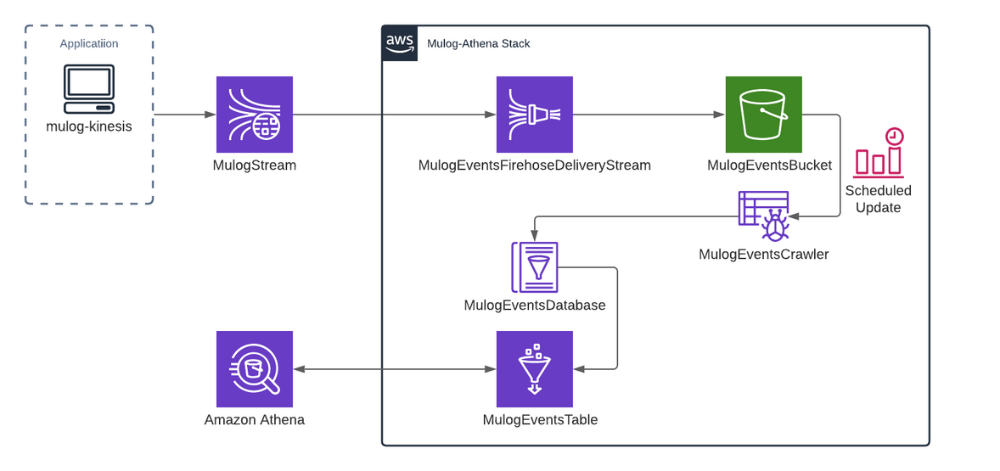
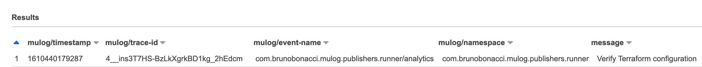
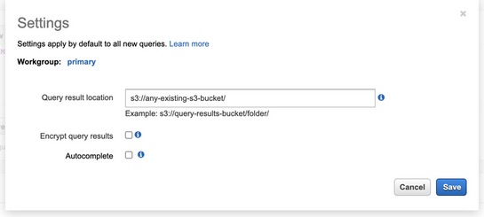
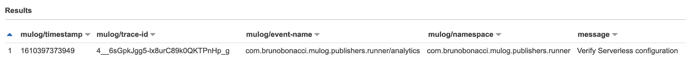
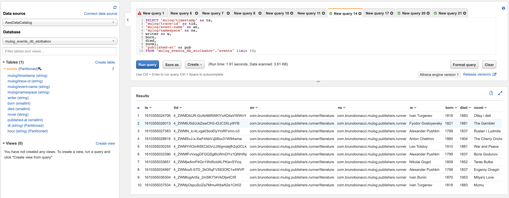
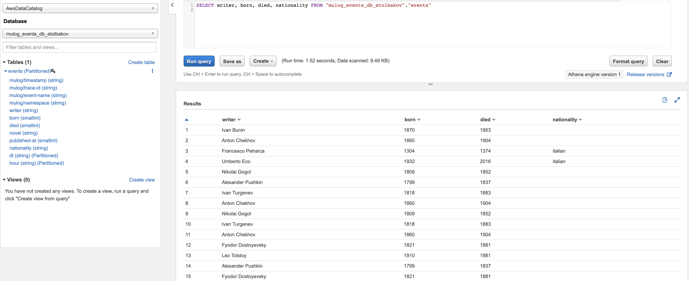
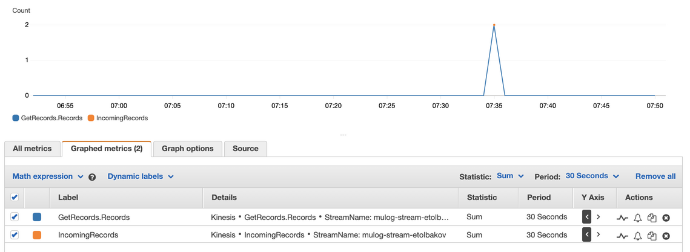
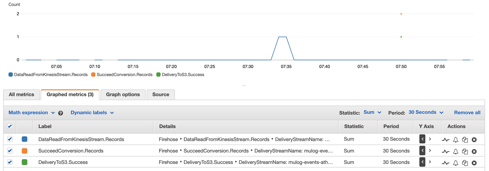
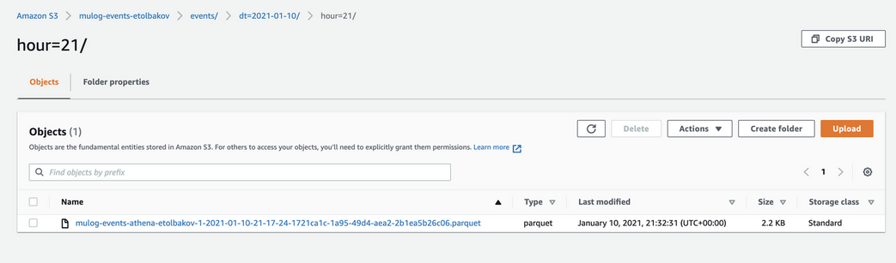
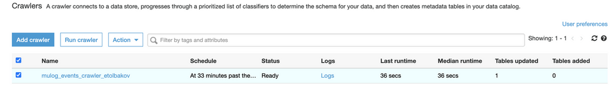

# How to query `µ/log` events using Amazon Athena

If you are already using **[`mulog-kinesis`
publisher](./publishers/kinesis-publisher.md)** and would like to **go
further** with some **analytics** on top of it you are in the right
section.

One simple command and everything that is required for analytics will
be created for you automatically.

* [Architecture](#architecture)
* [Setup](#setup)
  * [Terraform setup](#terraform-setup)
  * [Serverless setup](#serverless-setup)
  * [New Column](#new-column)
* [Troubleshooting](#troubleshooting)
* [Glue Crawler](#glue-crawler)

## Architecture

The analytics pipeline architecture is built with serverless
components that follow the standard “pay-as-you-go” models.  You are
paying only when you are sending or storing events.



An application publishes events via `mulog-kinesis` to the Kinesis
stream (`MulogStream`) that is connected to Kinesis
Firehose (`MulogEventsFirehoseDeliveryStream`).

Amazon Kinesis Firehose batches the data and stores it in S3 based on
either buffer size (1–128 MB) or buffer interval (60–900 seconds).
The criterion that is met first triggers the data delivery to Amazon
S3 bucket (`MulogEventsBucket`). This is where your raw data is being
stored.

`Lifecycle rules` can help to define actions you'd like to take on
your data: transition objects to another storage class, archive them,
or delete them after a specified period of time.  The latter option is
chosen for the current solution.

A scheduled crawler task (`MulogEventsCrawler`) examines an S3 data
source, determines its schema and records metadata concerning the data
source in the AWS Glue Data Catalog (`MulogEventsDatabase`).  Once
it's all done the actual data will be placed in AWS Glue
table(`MulogEventsTable`) and become available for running SQL queries
with `Amazon Athena` (serverless analytics service) or creating
visualization with `Amazon QuickSight` for further evaluation of your
data.

## Setup

The analytics pipeline can be provisioned either with
[Terraform](#Terraform setup) or [Serverless](#Serverless setup)
frameworks.  Please, follow the instructions of the relevant section
below.

### Terraform setup

*Please, make sure the [Terraform](https://www.terraform.io/) framework has already been installed.*

 1. Download the [`terraform scripts`](./athena-integration-provisioning/terraform/)
 2. assign the **name of your Kinesis stream** to the
    **`mulog_stream_name`** property in `terraform.tfvars` file.  Also
    set `profile`, `region`, `account_id` and `stage`. The scheduled
    crawler task is configured by `glue_crawler_schedule` variable.
 3. **customize** glue table **columns** to match your events:
    `"aws_glue_catalog_table" "mulog_events_table"s` resource in the
    `main.tf` file. For example, your application has the following
    `kinesis` publisher:
    ```
    (def kp
      (μ/start-publisher!
        {:type :kinesis :stream-name "mulog-stream"}))
    ```
    that publishes a simple event such as:
    ```
    (μ/log ::analytics :message "Verify Terraform configuration")
    ```
    The **column declaration** for this event in the `main.tf` file
    will look like:
    ```
    resource "aws_glue_catalog_table" "mulog_events_table" {
        ...
        columns {
          name = "mulog/timestamp"
          type = "string"
        }
        columns {
          name = "mulog/trace-id"
          type = "string"
        }
        columns {
          name = "mulog/event-name"
          type = "string"
        }
        columns {
          name = "mulog/namespace"
          type = "string"
        }
        columns {
          name = "message"
          type = "string"
        }
      }
    }
    ```

    After an event was published and processed it can be seen in
    Athena with the following query:

    ```
    SELECT * FROM "mulog_events_db"."mulog_events" limit 10;
    ```

    where **`"mulog_events_db"`** and **`"mulog_events"`** are the
    database and table names configured in the `main.tf` file.

    The query result looks like:
    

    `Mulog` reports `mulog/timestamp` and `mulog/trace-id` for any
    event. It aligns nicely with AWS recommendations regarding glue
    table partitions.  Other columns can be updated if necessary.

 4. execute commands to **deploy AWS resources**:
    ```
    terraform init
    terraform apply
    ```
 5. once the AWS resources are provisioned make sure Athena has **`Query result location`** specified in `Settings`.
    

### Serverless setup

*Please, make sure the
[Serverless](https://www.serverless.com/framework/docs/) framework has
already been installed.*

 1. Download the [`serverless scripts`](./athena-integration-provisioning/serverless).
 2. assign the **name of your Kinesis stream** to the
    **`mulogStreamName`** property in the `serverless_properties.yml`
    file.  Also set `region` and `deploymentBucket` (any S3 bucket that
    serverless can use to store deployment meta-data).  The scheduled
    crawler task is configured by `crawler.schedule` variable.
 3. **customize** glue table **columns** to match your events:
    `reporting.columns` property in the `serverless_properties.yml`
    file.

    For example, you have the following `kinesis` publisher:
    ```
    (def kp
      (μ/start-publisher!
        {:type :kinesis :stream-name "mulog-stream"}))
    ```
    that publishes a simple event such as:
    ```
      (μ/log ::analytics :message "Verify Serverless configuration")
    ```
    The column declaration for this case will look like:
    ```
    reporting:
      columns:
        - Name: mulog/timestamp
          Type: string
        - Name: mulog/trace-id
          Type: string
        - Name: mulog/event-name
          Type: string
        - Name: mulog/namespace
          Type: string
        - Name: message
          Type: string
    ```

    After an event was published and processed it can be seen in
    Athena with the following query:

    ```
    SELECT * FROM "mulog_events_db"."mulog_events" limit 10;
    ```

    where **`"mulog_events_db"`** and **`"mulog_events"`** are the
    database and table names configured in the
    `serverless_properties.yml` file.

    The query result looks like:
    

    `Mulog` reports `mulog/timestamp` and `mulog/trace-id` for any
    event. It aligns nicely with AWS recommendations regarding glue
    table partitions.

    Other columns can be updated if necessary.

 4. execute commands to **deploy AWS stack**:
    ```
    sls deploy  -v --stage your_stage
    ```
 5. once the AWS stack is provisioned make sure Athena has **`Query
    result location`** specified in `Settings`.


### New Columns

This section describes the case if new events appear with new columns.
Let's assume that our application pushes events about writers and
their novels.  The column declaration for this case will look like:

```
    columns:
      - Name: mulog/timestamp
        Type: string
      - Name: mulog/trace-id
        Type: string
      - Name: mulog/event-name
        Type: string
      - Name: mulog/namespace
        Type: string
      - Name: writer
        Type: string
      - Name: born
        Type: smallint
      - Name: died
        Type: smallint
      - Name: novel
        Type: string
      - Name: published-at
        Type: smallint
```

A couple of event examples:

```
  (μ/log ::literature :writer "Alexander Pushkin" :born 1799 :died 1837 :novel "Boris Godunov" :published-at 1825)
  (μ/log ::literature :writer "Fyodor Dostoyevsky" :born 1821 :died 1881 :novel "The Gambler" :published-at 1867)
  ...

```

This is how the first 10 records look in Athena. The query:

```
    SELECT "mulog/timestamp" as ts,
       "mulog/trace-id" as tid,
       "mulog/event-name" as en,
       "mulog/namespace" as ns,
        writer as w,
        born,
        died,
        novel,
        "published-at" as pub
    FROM "mulog_events_db_etolbakov"."events" limit 10;
```

and the result:



If we would like to differentiate writes by their nationality it's not
possible without **introducing the new `nationality` column**.  In
order to do that we need:

 1. Update the `columns` description (in the `main.tf` file or in the `serverless_properties.yml` file
    ```
        columns:
        ....
          - Name: nationality
            Type: string
    ```

 2. submit new events

    ```
      (μ/log ::literature :writer "Francesco Petrarca" :born 1304 :died 1374 :novel "Canzoniere" :published-at 1348 :nationality "italian")
      (μ/log ::literature :writer "Umberto Eco" :born 1932 :died 2016 :novel "Numero zero" :published-at 2015 :nationality "italian")
    ```
 3. run the glue crawler
 4. see the result(make sure that the new column appeared in the glue table schema)



## Troubleshooting

If for some reason you don't see events in Athena, the following things worth checking:

1. if the events were published to the Kinesis stream. There are
   several useful Cloudwatch Metrics, for example `IncomingRecords` or
   `GetRecords`
   
2. the next node is the Kinesis Firehose:<br>
   
3. if there were no errors in previous steps you should see a
   `parquet` file in S3.  Sometimes it makes sense to check the file
   itself, f.e. in online [Apache Parquet Viewer](http://parquet-viewer-online.com/).
   Please note, that Firehose perform buffering, so the events
   transfer to S3 doesn't happen immediately and may take a while.

   

4. the final bit is the glue crawler. Its table is quite
   self-explanatory and has a link the logs with more details about
   the recent job.

 

## Glue Crawler

The glue crawler serves several purposes:
 1. captures the data schema.
 2. creates a meta-data table (glue tables) inside the glue data
    catalog(a meta-data store).

Crawlers can become expensive, some things to keep in mind:

 1. if schema is not changing and no partitions being added there is
    no need to run the crawler.  The following cli command can pause
    the schedule execution, so you can run it whenever required.
    ```
    aws --profile=your_profile glue  stop-crawler-schedule --crawler-name your_crawler_name
    ```
 2. Partitions managing also can be done through glue APIs.
    For example, a lambda function that triggers create partition API will give the same end result.
 3. The number of crawlers is not configurable and each crawler usea 2 data-processing units(DPUs).
    You can check glue pricing for your region [here](https://aws.amazon.com/glue/pricing/)
