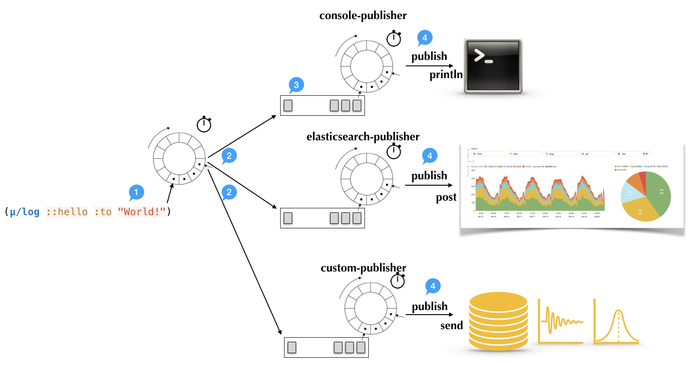

# μ/log internals

This article illustrates how ***μ/log*** works internally.  The
objective of this article is to deepen the understanding of the
technical choices and their consequences.

The design goals of ***μ/log*** are the following:

  1. log events in their pure form (values).
  2. negligible impact on performances, it should be super-fast.
  3. events are expendable, process flow should not be impacted.
  4. use as few dependencies as possible.
  5. easy way to publish events to a new system
  6. adding publishers should not impact performances

With the above goals in mind let's look at how it works!

Looking at the above picture let's see what happens step by step.

### Step (1) - Logging

Logging starts with a call to the `log` function. At this point
***μ/log*** does the least amount of work possible. In fact, it only
appends the event and the context captured at that point to a
`ring-buffer`. ***μ/log*** uses a *ring-buffer* to ensure that the use
of the memory is bound and it will not grow indiscriminately
potentially breaking the rule `n.3` and causing the application to run
out of memory. The operation is cheap (typically less than **200
nanoseconds**) and it is performed with a CAS atomic swap.  In highly
concurrent systems there could be retries. The assumption is the the
number of retries is less than 6; after this point it would cost more
than the enqueueing the operation with a mutex.

### Step (2) - Send to publishers

At regular intervals an asynchronous thread will take the content of
the buffer and send all the events to the registered publishers. The
operation is not blocking in either side. It reads the content of the
ring-buffer (atom) and sends the events to the publisher buffers
(agent ring-buffer).  The operation returns immediately and it is done
asynchronously.

### Step (3) - Publisher buffers

The publisher buffers are ring-buffers as well.  This is to ensure
that if one downstream system is not available for some time, the
accumulating events won't crash the system. All the operations on this
buffer are serialized and protected by an agent.

### Step (4) - Publish to downstream systems

At regular intervals, the `publish` function of the `PPublisher`
protocol is called with the content of the buffer.  The publishing
function can take the all the events (or part of them) and send them
to the downstream system.  If the operation is successful, the
publisher function returns the new state of the buffer minus the events
which have been successfully sent.  In case of failure, the operation
will be re-attempted at the next round.

Any sort of formatting, transformation and manipulation of the events
is done at this time, right before sending to the target system.
Therefore, it is important that all the values passed to the `log` function
are immutable.
Each system might require different pre-processing, and this processing
is done asynchronously for the logging itself.

For more information about how to implement custom publisher see:
[How to write custom publishers](custom-publishers.md)
