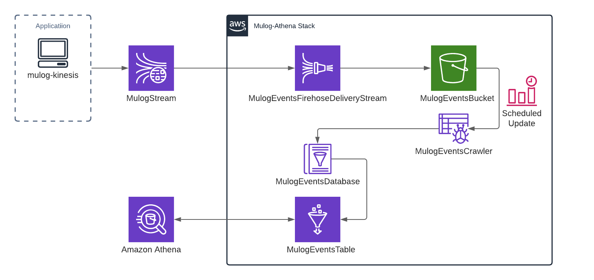
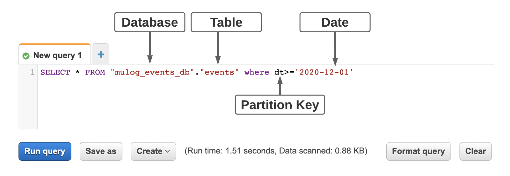
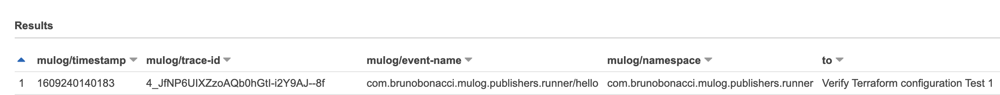
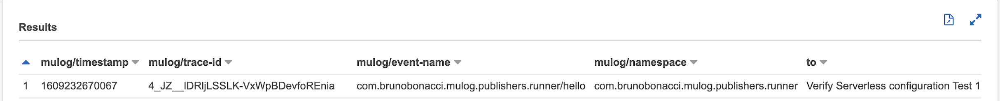

#`µ/log` - Amazon Athena integration

If you are already using **[`mulog-kinesis`](../mulog-kinesis) module** 
and would like to **go further** with some **analytics** on top of it you are in the right section.
We've implemented **[`mulog-athena`](../mulog-athena)** exactly for this case. 
One simple command and everything that is required for analytics will be created for you automatically.

###High-Level Solution Overview

An application publishes events via `mulog-kinesis` to the Kinesis stream(`MulogStream`) that is connected to Kinesis Firehose(`MulogEventsFirehoseDeliveryStream`). The latter delivers real-time streaming data to S3 bucket(`MulogEventsBucket`). 
From that point a scheduled crawler task(`MulogEventsCrawler`) examines an S3 data source, determines its schema and records metadata concerning the data source in the AWS Glue Data Catalog(`MulogEventsDatabase`).
Once it's all done the actual data will be placed in AWS Glue table(`MulogEventsTable`) and becomes available for running queries with `Amazon Athena`. 
For visualization Amazon QuickSight(in progress) can be used.

#Setup
The module supports [Terraform](#Terraform setup) and [Serverless](#Serverless setup) frameworks.

### Terraform setup
*Please, make sure the [Terraform](https://www.terraform.io/)  framework has already been installed.*

 1. navigate to the [`terraform`](terraform) folder inside `mulog-athena` module.
 2. assign the **name of your Kinesis stream** to the **`mulog_stream_name`** property in [`terraform.tfvars`](./terraform/terraform.tfvars) file.<br/>
 Also set `profile`, `region`, `account_id` and `stage`. The scheduled crawler task is configured by `glue_crawler_schedule` variable.<br/>
 3. customize AWS Glue Table columns according to your needs(`"aws_glue_catalog_table" "mulog_events_table"s` resource in [`main.tf`](./terraform/main.tf) file).<br/>
    For example, you have the following `kinesis` publisher:
    ```
    (def kp
      (μ/start-publisher!
        {:type :kinesis :stream-name "mulog-stream"}))
    ``` 
    that publishes a simple event:
    ```
    (μ/log ::hello :to "Verify Terraform configuration Test 1")
    ```
    The column declaration for this case will look like:
    ```
    resource "aws_glue_catalog_table" "mulog_events_table" {
        ...
        columns {
          name = "mulog/timestamp"
          type = "string"
        }
        columns {
          name = "mulog/trace-id"
          type = "string"
        }
        columns {
          name = "mulog/event-name"
          type = "string"
        }
        columns {
          name = "mulog/namespace"
          type = "string"
        }
        columns {
          name = "to"
          type = "string"
        }
      }
    }
    ```
    The following Athena query 
     
    will give the result:
     
     
    `Mulog` reports `mulog/timestamp` and `mulog/trace-id` for any event. It aligns nicely with AWS recommendations regarding each record to have a timestamp and unique id.       

4. execute commands to deploy AWS resources:
    ```
    terraform init
    terraform apply --auto-approve
    ```

### Serverless setup
*Please, make sure the [Serverless](https://www.serverless.com/framework/docs/) framework has already been installed.*

 1. navigate to the [`serverless`](serverless) folder inside `mulog-athena` module.
 2. assign the **name of your Kinesis stream** to the **`mulogStreamName`** property in [`serverless_properties.yml`](./serverless/serverless_properties.yml) file.<br>
 Also set `region` and `deploymentBucket` (any S3 bucket that serverless can use to store deployment meta-data). 
 The scheduled crawler task is configured by `crawler.schedule` variable.<br/>
 3. customize AWS Glue Table columns according to your needs(`reporting.columns` property in [`serverless_properties.yml`](./serverless/serverless_properties.yml) file).<br/>
    For example, you have the following `kinesis` publisher:
    ```
    (def kp
      (μ/start-publisher!
        {:type :kinesis :stream-name "mulog-stream"}))
    ```
    that publishes a simple event:
    ```
      (μ/log ::hello :to "Verify Serverless configuration Test 1")
    ```
    The column declaration for this case will look like:
    ```
    reporting:
      columns:
        - Name: mulog/timestamp
          Type: string
        - Name: mulog/trace-id
          Type: string
        - Name: mulog/event-name
          Type: string
        - Name: mulog/namespace
          Type: string
        - Name: to
          Type: string
    ```
    The following Athena query:
     
    will give the result:
     
    
    `Mulog` reports `mulog/timestamp` and `mulog/trace-id` for any event. It aligns nicely with AWS recommendations regarding each record to have a timestamp and unique id. 

 4. execute commands to deploy AWS resources:
    ```
    sls deploy  -v --stage your_stage
    ```
