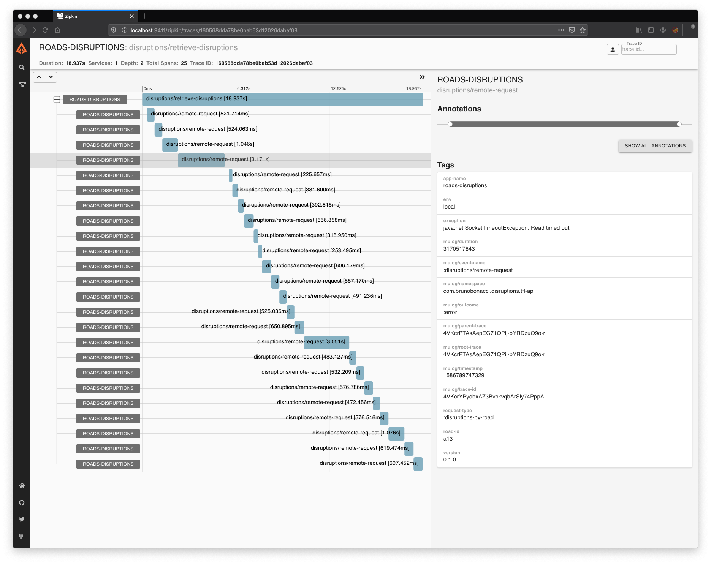

# μ/log -> OpenZipkin publisher
[](https://clojars.org/com.brunobonacci/mulog-zipkin)

This project contains the `publisher` for [OpenZipkin](https://zipkin.io/)


## Usage

Please see [Documentation page](../doc/publishers/zipkin-publisher.md).

## Testing

``` shell
docker-compose rm -f && docker-compose up -d
```

Then open: http://localhost:9411/ for Zipkin UI

Here is an example of Zipkin traces:




## License

Copyright © 2019-2021 Bruno Bonacci - Distributed under the [Apache License v2.0](http://www.apache.org/licenses/LICENSE-2.0)
